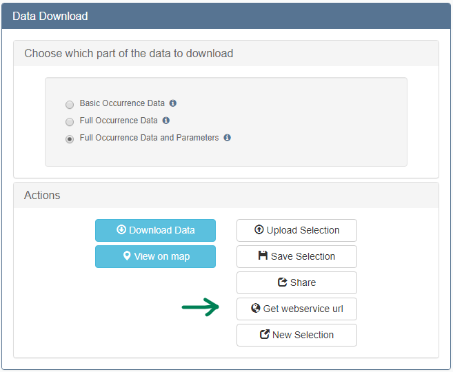

# Web services documentation

The EMODnet Biology data are available as a [Web Feature Service (WFS)](https://docs.geoserver.org/latest/en/user/services/wfs/index.html) in accordance with the [Open Geospatial Consortium (OGC)](https://www.ogc.org/) specifications. This webservice supports requests for geographical feature data (with vector geometry and attributes). The base link for performing a WFS request to EMODnet Biology is:

[https://geo.vliz.be/geoserver/Dataportal/ows?](https://geo.vliz.be/geoserver/Dataportal/ows?)

Essentially, the [Download Toolbox](https://www.emodnet-biology.eu/toolbox) developed by EMODnet Biology acts as an interactive builder of WFS requests . The URL to the WFS request can be copied to the clipboard at the last step of the selection in the Download Toolbox.



EMODnet Biology aims to follow the [FAIR principles](https://www.go-fair.org/fair-principles/). The data formats presented by EMODnet Biology enhances its interoperability by providing a link to other marine biogeographical data systems developed by VLIZ as the [World Record of Marine Species (WoRMS)](https://www.marinespecies.org/), [MarineRegions.org](https://marineregions.org/) or the [Integrated Marine Information System (IMIS)](https://www.vliz.be/en/imis?module=dataset). Please find below more information about the webservices offered by these projects.

### Occurrence data (species observations) as Web Feature Services (WFS)

##### **Data formats**: 

There are three data formats presented by EMODnet Biology. The syntax for specifying a data format is:

```
typeName=Dataportal:<data_format>
```

The **Basic Occurrence Data** provides you with all data necessary to do temporal spatial analysis of the different taxa. It indicates which taxa was found (`scientificname` and `aphiaid`), when (`datecollected`) and where (`decimallongitude` and `decimallatitude` in WGS84 - EPGS:4326), along with an identifier of the dataset (`datasetid`). The syntax for requesting this data format is: `eurobis-obisenv_basic`

The **Full Occurrence Data** provides additional information which may help interpret the basic data. This format offers all the data from the Basic Occurrences plus The syntax for requesting this data format is: `eurobis-obisenv_full`

The **Full Occurrence Data and Parameters** provides you also with all quantitative data and facts associated to the occurrence or the sample. The syntax for requesting this data format is: `eurobis-obisenv`

You can find more information about the terms returned by each download type in the [documentation](https://www.emodnet-biology.eu/emodnet-data-format). 


##### **Output formats**: 

The EMODnet Biology data is available in a number of [output formats](https://docs.geoserver.org/latest/en/user/services/wfs/outputformats.html), which are indicated at the end of the WFS request as:

```
  outputFormat=<output_format>
```

The following GetCapabilities request returns the complete list of output formats available for each type of WFS request (For example, see the GetFeatures request)

https://geo.vliz.be/geoserver/Dataportal/ows?service=wfs&version=1.1.0&request=GetCapabilities


##### **Building a query:** 

The different parameters in which you can perform a query can be consulted using a `DescribeFeatureType` WFS request. In the case of the Basic Occurrence Data this is:

[https://geo.vliz.be/geoserver/Dataportal/ows?service=wfs&version=2.0.0&request=**DescribeFeatureType**&typeName=Dataportal:**eurobis-obisenv_basic**&outputFormat=application/json](http://geo.vliz.be/geoserver/Dataportal/ows?service=wfs&version=2.0.0&request=DescribeFeatureType&typeName=Dataportal:eurobis-obisenv_basic&outputFormat=application/json)

Please see these examples for more information on how to query EMODnet Biology data using WFS.

  - **Basic Occurrence Data**

    This request will return the first 50 basic occurrences from the dataset *Monitoring of birds in the Voordelta* ([4569](http://www.emodnet-biology.eu/data-catalog?module=dataset&dasid=4659)) as csv:

    [https://geo.vliz.be/geoserver/Dataportal/ows?service=WFS&version=1.0.0&request=GetFeature&typeName=Dataportal:**eurobis-obisenv_basic**&&viewParams=where:**datasetid=4659**&**maxFeatures=50**&outputformat=**csv**](https://geo.vliz.be/geoserver/Dataportal/ows?service=WFS&version=1.0.0&request=GetFeature&typeName=Dataportal:eurobis-obisenv_basic&&viewParams=where:datasetid=4659&maxFeatures=50&outputformat=csv)

  - **Full Occurrence Data**

    The following example retrieves a Shapefile with the full occurrence data of the seabird Herring gull (*Larus argentatus*) using its AphiaID [137138](http://www.marinespecies.org/aphia.php?p=taxdetails&id=137138) (this request might take a while to complete):

    [https://geo.vliz.be/geoserver/Dataportal/ows?service=WFS&version=1.0.0&request=GetFeature&typeName=Dataportal:**eurobis-obisenv_full**&&viewParams=where:**aphiaidaccepted=137138**&outputformat=**SHAPE-ZIP**](https://geo.vliz.be/geoserver/Dataportal/ows?service=WFS&version=1.0.0&request=GetFeature&typeName=Dataportal:eurobis-obisenv_full&&viewParams=where:aphiaidaccepted=137138&outputformat=SHAPE-ZIP)

    Querying for two or more conditions is also possible. See in the following example how to request the occurrences of the seabird Herring gull (*Larus argentatus* [137138](http://www.marinespecies.org/aphia.php?p=taxdetails&id=137138)) in the dataset *Monitoring of birds in the Voordelta* ([4569](http://www.emodnet-biology.eu/data-catalog?module=dataset&dasid=4659)) as JSON:

    [https://geo.vliz.be/geoserver/Dataportal/ows?service=WFS&version=1.0.0&request=GetFeature&typeName=Dataportal:eurobis-obisenv_full&&viewParams=where:**aphiaidaccepted=137138 AND datasetid=4659**&outputformat=**application/json**](https://geo.vliz.be/geoserver/Dataportal/ows?service=WFS&version=1.0.0&request=GetFeature&typeName=Dataportal:eurobis-obisenv_full&&viewParams=where:aphiaidaccepted=137138%20AND%20datasetid=4659&outputformat=application/json)

  - **Full Occurrence Data and Parameters**

    The WFS request allows the use of `OR` statements. You can retrieve a CSV with the full occurrence data and parameters of both the White furrow (*Alba alba* [141433](http://www.marinespecies.org/aphia.php?p=taxdetails&id=141433)) and the Common razor shells (*Ensis ensis* [140733](http://www.marinespecies.org/aphia.php?p=taxdetails&id=140733)):
  
    [https://geo.vliz.be/geoserver/Dataportal/ows?service=WFS&version=1.0.0&request=GetFeature&typeName=Dataportal:**eurobis-obisenv**&viewParams=where:**aphiaidaccepted=141433 OR aphiaidaccepted=140733**&outputformat=**csv**](https://geo.vliz.be/geoserver/Dataportal/ows?service=WFS&version=1.0.0&request=GetFeature&typeName=Dataportal:eurobis-obisenv&viewParams=where:aphiaidaccepted=141433 OR aphiaidaccepted=140733&outputformat=csv)
  
    This request will return one row per parameter available in EMODnet Biology, instead of one row per occurrence as the basic and full occurrence data do. See the [documentation](https://www.emodnet-biology.eu/emodnet-data-format) on data types for more information.


##### Other services

In addition to the three data formats, EMODnet Biology also makes available through its webservices the possibility of returning the total **occurrences count** for a certain query, its occurrence data as **gridded abundances** in a GIS Layers, and the [**data products**](https://www.emodnet-biology.eu/toolbox/en/gallery/) developed by the EMODnet Biology community:

  - **Retrieve the count of occurrences**: You can retrieve the total number of records available in EMODnet Biology for a certain query using the sentence `Dataportal:eurobis-obisenv_count`. The example below will return the number of occurrences in the dataset *Monitoring of birds in the Voordelta* ([4569](http://www.emodnet-biology.eu/data-catalog?module=dataset&dasid=4659)):
  
    [https://geo.vliz.be/geoserver/Dataportal/ows?service=WFS&version=1.0.0&request=GetFeature&typeName=Dataportal:**eurobis-obisenv_count**&&viewParams=where:**datasetid=4659**&outputformat=application/json](https://geo.vliz.be/geoserver/Dataportal/ows?service=WFS&version=1.0.0&request=GetFeature&typeName=Dataportal:eurobis-obisenv_count&&viewParams=where:datasetid=4659&outputformat=application/json)

- **Retrieve data of the gridded abundance:** EMODnet Biology also offers occurrences as geospatial products. There are four grid size levels available, plus the possibility of retrieving each point directly. To query any of these five options, the correct table must be specified in the request:

  - One degree: `&typeName=Dataportal:eurobis_grid_1d-obisenv`

  - 30 minutes: `&typeName=Dataportal:eurobis_grid_30m-obisenv`

  - 15 minutes: `&typeName=Dataportal:eurobis_grid_15m-obisenv`

  - Six minutes:  `&typeName=Dataportal:eurobis_grid_6m-obisenv`

  - Points layer: `&typeName=Dataportal:eurobis_points-obisenv`

  For example, this WFS request will return the 30 minutes gridded abundance of the seabird Herring gull (*Larus argentatus* [137138](http://www.marinespecies.org/aphia.php?p=taxdetails&id=137138)) as KML:

  [https://geo.vliz.be/geoserver/wfs/ows?service=WFS&version=1.3.0&request=GetFeature&typeName=Dataportal:**eurobis_grid_30m-obisenv**&viewParams=**aphiaid:137138**&outputFormat=**application/vnd.google-earth.kml+xml**](https://geo.vliz.be/geoserver/wfs/ows?service=WFS&version=1.3.0&request=GetFeature&typeName=Dataportal:eurobis_grid_30m-obisenv&viewParams=aphiaid:137138&outputFormat=application/vnd.google-earth.kml+xml)

- **Retrieving data products**: EMODnet Biology develops data products that are accessible through WFS services. For example, the following requests return the [OOPS Copepod gridded abundances](https://www.emodnet-biology.eu/data-catalog?module=dataset&dasid=5438) in 1 and 10 years bin respectively:

    - [OOPS Copepod gridded abundances 10-year bin](http://geo.vliz.be/geoserver/Emodnetbio/wms?service=WMS&version=1.1.0&request=GetMap&layers=Emodnetbio:OOPS_products&styles=&bbox=-4.95,48.05,12.25,60.75&width=512&height=378&srs=EPSG:4326&format=application/openlayers&viewparams=scientificName:Large copepods;season:1;AphiaID:1080;startYearCollection:1958;endYearCollection:1967)
    - [OOPS Copepod gridded abundances 1-year bin](http://geo.vliz.be/geoserver/Emodnetbio/wms?service=WMS&version=1.1.0&request=GetMap&layers=Emodnetbio:OOPS_products&styles=&bbox=-4.95,48.05,12.25,60.75&width=512&height=378&srs=EPSG:4326&format=application/openlayers&viewparams=scientificName:Large copepods;season:1;AphiaID:1080;startYearCollection:1958;endYearCollection:1958)

### Interoperability with other marine biogeographical data systems

* **Taxonomy: World Record of Marine Species (WoRMS)**

  Regarding taxonomy, the EMODnet Biology data is connected to the services provided by the [World Record of Marine Species (WoRMS)](https://www.marinespecies.org/) using the [AphiaID](https://www.marinespecies.org/about.php#what_is_aphia). This is provided in the `aphiaid` and `aphiaidaccepted` columns. WoRMS can provide detailed descriptions of marine species. For example, this request returns the distribution of the Herring Gull (*Larus argentatus* [137138](http://www.marinespecies.org/aphia.php?p=taxdetails&id=137138)). Notice how these distribution areas are linked to Marine Regions by providing the MRGID of the geographical area where this species has been observed. 

  [https://www.marinespecies.org/rest/**AphiaDistributionsByAphiaID**/**137138**](https://www.marinespecies.org/rest/AphiaDistributionsByAphiaID/137138)

  A general description of all the webservices offered by WoRMS can be found here:

  http://www.marinespecies.org/aphia.php?p=webservice

* **Geographic: Marine Regions**

  EMODnet Biology allows to query information to standardized areas by using the [MRGID](https://marineregions.org/mrgid.php) provided by [MarineRegions.org](https://marineregions.org/). This is an unique and persistent identifier of geographic objects. You can easily select the area of interest using the [Download Toolbox](https://www.emodnet-biology.eu/toolbox) and copying the WFS request generated. 

  For example, this request returns all specimens of the seabird Herring gull (*Larus argentatus* [137138](http://www.marinespecies.org/aphia.php?p=taxdetails&id=137138)) in the Belgian Exclusive Economic Zone (MRGID [3293](https://marineregions.org/gazetteer.php?p=details&id=3293)):

  [https://geo.vliz.be/geoserver/wfs/ows?service=WFS&version=1.1.0&request=GetFeature&typeName=Dataportal%3Aeurobis-obisenv_basic&resultType=results&viewParams=where%3A%28%28up.geoobjectsids+%26%26+ARRAY%5B**3293**%5D%29%29%3Bcontext%3A0100%3Baphiaid%3A**137138**&propertyName=datasetid%2Cdatecollected%2Cdecimallatitude%2Cdecimallongitude%2Ccoordinateuncertaintyinmeters%2Cscientificname%2Caphiaid%2Cscientificnameaccepted&outputFormat=csv](https://geo.vliz.be/geoserver/wfs/ows?service=WFS&version=1.1.0&request=GetFeature&typeName=Dataportal%3Aeurobis-obisenv_basic&resultType=results&viewParams=where%3A%28%28up.geoobjectsids+%26%26+ARRAY%5B3293%5D%29%29%3Bcontext%3A0100%3Baphiaid%3A137138&propertyName=datasetid%2Cdatecollected%2Cdecimallatitude%2Cdecimallongitude%2Ccoordinateuncertaintyinmeters%2Cscientificname%2Caphiaid%2Cscientificnameaccepted&outputFormat=csv)

  This request to the Marine Regions webservices provides the information about Belgian Exclusive Economic Zone (MRGID [3293](https://marineregions.org/gazetteer.php?p=details&id=3293)) included in the Marine Regions Gazetteer:

  [https://marineregions.org/rest/**getGazetteerRecordByMRGID**.json/**3293**/](https://marineregions.org/rest/getGazetteerRecordByMRGID.json/3293/)

  If you wish to retrieve the geometry associated to this Gazetteer record, you can use the WFS offered by Marine Regions. The following request makes use of a [CQL filter](https://docs.geoserver.org/latest/en/user/tutorials/cql/cql_tutorial.html) to download a Zip file with the ESRI Shapefile of the Belgian Exclusive Economic Zone (MRGID [3293](https://marineregions.org/gazetteer.php?p=details&id=3293)):

  [https://geo.vliz.be/geoserver/**MarineRegions**/wfs?service=WFS&version=1.0.0&request=GetFeature&typeNames=eez&cql_filter=**mrgid=3293**&outputFormat=**SHAPE-ZIP**](https://geo.vliz.be/geoserver/MarineRegions/wfs?service=WFS&version=1.0.0&request=GetFeature&typeNames=eez&cql_filter=mrgid=3293&outputFormat=SHAPE-ZIP)

  You can find the complete description of the Gazetteer and OGS services offered by Marine Regions in the two following links respectively:

  - https://marineregions.org/gazetteer.php?p=webservices

  - https://marineregions.org/webservices.php

* **Metadata: Integrated Marine Information System (IMIS)**

  Retrieve metadata about a dataset is possible thanks to the connection to the [Integrated Marine Information System (IMIS)](https://www.vliz.be/en/imis?module=dataset). This web service is descripted here in detail:

  https://www.emodnet-biology.eu/data-catalog?page=webservices

  The following example returns the `datasetid` (or IMIS dasID) of the dataset *Monitoring of birds in the Voordelta* ([4569](http://www.emodnet-biology.eu/data-catalog?module=dataset&dasid=4659)) as JSON

  [https://www.emodnet-biology.eu/data-catalog?module=dataset&**dasid=4659**&**show=json**](https://www.emodnet-biology.eu/data-catalog?module=dataset&dasid=4659&show=json)

### **R client for EMODnet Biology webservices:**

The EMODnet Biology data is accessible as well through its R package, which provides a wrapper around the webservices described above. You can find more information on the GitHub repository:

https://github.com/lifewatch/eurobis/

Some data applications using EMODnet Biology data has been written in R using the shiny framework: These are available at:

- http://rshiny.emodnet-biology.eu/OOPS/
- http://rshiny.emodnet-biology.eu/SHARKshiny/
