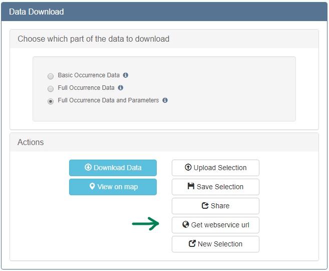

# EMODnet Biology web service documentation

EMODnet Biology brings together marine biodiversity data from a large network of European and international data providers. This page explains how to access these data in a machine-readable way: through OGC web services, through R packages, and as parquet files in the EDITO data lake.

## Where to start

- **EMODnet catalogue**: every EMODnet Biology dataset is described by a metadata record in the [EMODnet catalogue](https://emodnet.ec.europa.eu/geonetwork/srv/eng/catalog.search#/home). This is the best entry point to find datasets. Each record gives the title, abstract, citation, licence and access links of a dataset, together with its dataset identifier (`datasetid`), which you can use to filter the web services described below. Record links follow the pattern `https://emodnet.ec.europa.eu/geonetwork/srv/eng/catalog.search#/metadata/6d617269-6e65-696e-666f-<datasetid padded with zeros to 12 digits>`, for example [dataset 4659](https://emodnet.ec.europa.eu/geonetwork/srv/eng/catalog.search#/metadata/6d617269-6e65-696e-666f-000000004659).
- **EMODnet Viewer**: the [EMODnet Viewer](https://emodnet.ec.europa.eu/geoviewer) lets you explore, filter and download EMODnet Biology occurrence data on a map.
- 
- **Web services**: the OGC web services (WFS, WMS) give direct access to the same data from scripts and GIS software. They are explained in detail on this page. An overview of all EMODnet Biology service endpoints is available in the [EMODnet web service documentation](https://emodnet.ec.europa.eu/en/emodnet-web-service-documentation).
- **EDITO data lake**: the complete occurrence data are also published as [parquet files](#emodnet-biology-data-as-parquet-files-in-edito) in the European Digital Twin of the Ocean (EDITO).
- **EurOBIS**: EMODnet Biology occurrence data are integrated and served through EurOBIS, hosted by the Flanders Marine Institute (VLIZ). The [EurOBIS Download Toolbox](https://www.eurobis.org/toolbox/en/download/occurrence/explore) offers the same data with an interactive selection interface.

---

## EMODnet Biology occurrence data (WFS)

The EMODnet Biology occurrence data are available as a [Web Feature Service (WFS)](https://docs.geoserver.org/stable/en/user/services/wfs/index.html) following the [Open Geospatial Consortium (OGC)](https://www.ogc.org/) specifications. A WFS request returns geographical features (vector geometries with their attributes). The base link for a WFS request to EMODnet Biology is:

[https://geo.vliz.be/geoserver/Dataportal/ows?](https://geo.vliz.be/geoserver/Dataportal/ows?)

You do not need to write requests by hand. The [EurOBIS Download Toolbox](https://www.eurobis.org/toolbox/en/download/occurrence/explore) works as an interactive builder for WFS requests: at the last step of the selection, the URL of the WFS request can be copied to the clipboard.



The technical details of the service, including the available layers and output formats, can be retrieved with a GetCapabilities request:

[https://geo.vliz.be/geoserver/Dataportal/ows?service=wfs&version=1.1.0&request=GetCapabilities](https://geo.vliz.be/geoserver/Dataportal/ows?service=wfs&version=1.1.0&request=GetCapabilities)

---

### Building a WFS request

A WFS request is composed of four parts, joined with `&`:

1. the base URL
2. the data format
3. filtering options (optional)
4. the output format

#### 1. The base URL

```
https://geo.vliz.be/geoserver/Dataportal/ows?service=WFS&version=1.0.0&request=GetFeature&
```

All examples on this page use WFS version 1.0.0, where the number of returned records is limited with `maxFeatures`. Requests for the Basic and Full Occurrence Data should always contain at least one filter, for example a dataset or a taxon (see [Filtering options](#3-filtering-options)). Without a filter, these requests can take too long to complete, even with `maxFeatures`. One request returns at most 1,000,000 records. For larger downloads, split the request (for example by dataset) or use the [parquet files in EDITO](#emodnet-biology-data-as-parquet-files-in-edito).

#### 2. The data format

The data format is selected with the `typeName` parameter:

```
typeName=Dataportal:<data_format>
```

EMODnet Biology offers the following [data formats](https://emodnet.ec.europa.eu/en/biology). The terms returned by each format are listed in the *Data format* section of that page.

| Data format | `typeName` |
| --- | --- |
| Basic Occurrence Data | `eurobis-obisenv_basic` |
| Full Occurrence Data | `eurobis-obisenv_full` |
| Full Occurrence Data and Parameters | `eurobis-obisenv` |
| DNA derived data | `eurobis-dna` (see [Genomics data](#genomics-data-dna-derived-occurrences)) |
| DNA derived data without parameters | `eurobis-dna_full` (see [Genomics data](#genomics-data-dna-derived-occurrences)) |

- **Basic Occurrence Data**

  The **Basic Occurrence Data** contain everything needed for spatial and temporal analyses of taxa: which taxon was found (`scientificname` and `aphiaid`), when (`datecollected`) and where (`decimallongitude` and `decimallatitude` in WGS84, EPSG:4326), together with a dataset identifier (`datasetid`). The Basic Occurrence Data have no geometry column: a Shapefile cannot be created and KML files contain no positions. Use the Full Occurrence Data for these output formats.

  This request returns the first 50 basic occurrence records of the dataset *Monitoring of birds in the Voordelta* ([datasetid 4659](https://emodnet.ec.europa.eu/geonetwork/srv/eng/catalog.search#/metadata/6d617269-6e65-696e-666f-000000004659)):

  ```
  https://geo.vliz.be/geoserver/Dataportal/ows?service=WFS&version=1.0.0&request=GetFeature&typeName=Dataportal:eurobis-obisenv_basic&viewParams=datasetid:4659&maxFeatures=50&outputformat=csv
  ```

  [Open this request](https://geo.vliz.be/geoserver/Dataportal/ows?service=WFS&version=1.0.0&request=GetFeature&typeName=Dataportal:eurobis-obisenv_basic&viewParams=datasetid:4659&maxFeatures=50&outputformat=csv)

- **Full Occurrence Data**

  The **Full Occurrence Data** contain all fields of the Basic Occurrence Data plus additional information that helps to interpret them, such as the institute that collected the data, the sampling methodology, the exact time and location, and their uncertainty.

  This request returns the first 50 full occurrence records of the dataset *Monitoring of birds in the Voordelta* ([datasetid 4659](https://emodnet.ec.europa.eu/geonetwork/srv/eng/catalog.search#/metadata/6d617269-6e65-696e-666f-000000004659)):

  ```
  https://geo.vliz.be/geoserver/Dataportal/ows?service=WFS&version=1.0.0&request=GetFeature&typeName=Dataportal:eurobis-obisenv_full&viewParams=datasetid:4659&maxFeatures=50&outputformat=csv
  ```

  [Open this request](https://geo.vliz.be/geoserver/Dataportal/ows?service=WFS&version=1.0.0&request=GetFeature&typeName=Dataportal:eurobis-obisenv_full&viewParams=datasetid:4659&maxFeatures=50&outputformat=csv)

- **Full Occurrence Data and Parameters**

  The **Full Occurrence Data and Parameters** add all measurements or facts associated with the occurrence or the sampling event (for example abundance, biomass, sampling gear or environmental variables). Each measurement is returned as a separate row, so one occurrence can appear on several rows.

  This request returns the first 50 records of the dataset *Monitoring of birds in the Voordelta* ([datasetid 4659](https://emodnet.ec.europa.eu/geonetwork/srv/eng/catalog.search#/metadata/6d617269-6e65-696e-666f-000000004659)):

  ```
  https://geo.vliz.be/geoserver/Dataportal/ows?service=WFS&version=1.0.0&request=GetFeature&typeName=Dataportal:eurobis-obisenv&viewParams=datasetid:4659&maxFeatures=50&outputformat=csv
  ```

  [Open this request](https://geo.vliz.be/geoserver/Dataportal/ows?service=WFS&version=1.0.0&request=GetFeature&typeName=Dataportal:eurobis-obisenv&viewParams=datasetid:4659&maxFeatures=50&outputformat=csv)


#### 3. Filtering options

Filters are passed with the `viewParams` parameter. Each filter has the form `name:value`, and several filters are combined with a semicolon:

```
viewParams=<filter_1>;<filter_2>
```

The following filters are available:

| Filter | Syntax | Example |
| --- | --- | --- |
| Dataset | `datasetid:<datasetid>` | `datasetid:4659` |
| Taxon (WoRMS AphiaID) | `aphiaid:<AphiaID>` | `aphiaid:137138` |
| Several taxa | `aphiaid:<AphiaID>\,<AphiaID>` | `aphiaid:141433\,140733` |
| Absence records | `includeAbsences:1` | see [Absence data](#absence-data) |
| Marine region (MRGID) | `bounds:geoid && ARRAY[<MRGID>]` | `bounds:geoid && ARRAY[3293]` |

The dataset, taxon and geography filters link EMODnet Biology to other services, which are described at the [end of this page](#other-marine-data-systems-connected-to-emodnet-biology).

The `where:` parameter used in older examples is still accepted, but the dedicated filters in the table above are recommended wherever they are available.

Filter names are not checked. A misspelled or unknown filter is ignored without an error message, and the request then returns data without that filter.

- **Dataset**

  Every dataset has a unique `datasetid`, which is shown in its record in the [EMODnet catalogue](https://emodnet.ec.europa.eu/geonetwork/srv/eng/catalog.search#/home). Behind the catalogue, the metadata are managed in the [Integrated Marine Information System (IMIS)](https://www.vliz.be/en/imis?module=dataset) of the Flanders Marine Institute (VLIZ).

  The data format examples above already use the dataset filter. This request returns the first 50 full occurrence records of the dataset *LifeWatch observatory data: permanent Cetacean passive acoustic sensor network in the Belgian part of the North Sea* ([datasetid 5531](https://emodnet.ec.europa.eu/geonetwork/srv/eng/catalog.search#/metadata/6d617269-6e65-696e-666f-000000005531)) as a CSV file:

  ```
  https://geo.vliz.be/geoserver/Dataportal/ows?service=WFS&version=1.0.0&request=GetFeature&typeName=Dataportal:eurobis-obisenv_full&viewParams=datasetid:5531&maxFeatures=50&outputformat=csv
  ```

  [Open this request](https://geo.vliz.be/geoserver/Dataportal/ows?service=WFS&version=1.0.0&request=GetFeature&typeName=Dataportal:eurobis-obisenv_full&viewParams=datasetid:5531&maxFeatures=50&outputformat=csv)

- **Taxonomy: World Register of Marine Species (WoRMS)**

  EMODnet Biology data are linked to the [World Register of Marine Species (WoRMS)](https://www.marinespecies.org/) through the [AphiaID](https://www.marinespecies.org/about.php#what_is_aphia). The output contains both the AphiaID of the name as provided in the source dataset (`aphiaid`) and the AphiaID of the currently accepted name (`aphiaidaccepted`).

  This request returns the full occurrence data of the bivalve *Ensis ensis* (AphiaID [140733](https://www.marinespecies.org/aphia.php?p=taxdetails&id=140733)) as a CSV file:

  ```
  https://geo.vliz.be/geoserver/Dataportal/ows?service=WFS&version=1.0.0&request=GetFeature&typeName=Dataportal:eurobis-obisenv_full&viewParams=aphiaid:140733&outputformat=csv
  ```

  [Open this request](https://geo.vliz.be/geoserver/Dataportal/ows?service=WFS&version=1.0.0&request=GetFeature&typeName=Dataportal:eurobis-obisenv_full&viewParams=aphiaid:140733&outputformat=csv)

  The taxon filter works on the accepted name in WoRMS. It also returns records that were published under a synonym, and records of all lower taxa. For example, `aphiaid:137043` (the genus *Larus*) returns records of *Larus argentatus*, *Larus fuscus*, *Larus marinus* and other gull species.

  Several taxa can be requested at once by separating the AphiaIDs with an escaped comma (`\,`, or `%5C,` in a URL). This request returns the full occurrence data and parameters of the bivalves *Abra alba* (AphiaID [141433](https://www.marinespecies.org/aphia.php?p=taxdetails&id=141433)) and *Ensis ensis* (AphiaID [140733](https://www.marinespecies.org/aphia.php?p=taxdetails&id=140733)):

  ```
  https://geo.vliz.be/geoserver/Dataportal/ows?service=WFS&version=1.0.0&request=GetFeature&typeName=Dataportal:eurobis-obisenv&viewParams=aphiaid:141433\,140733&outputformat=csv
  ```

  [Open this request](https://geo.vliz.be/geoserver/Dataportal/ows?service=WFS&version=1.0.0&request=GetFeature&typeName=Dataportal:eurobis-obisenv&viewParams=aphiaid:141433%5C,140733&outputformat=csv)

- **Geography: Marine Regions**

  EMODnet Biology data can be queried for standardised areas using the [MRGID](https://marineregions.org/mrgid.php) of [MarineRegions.org](https://marineregions.org/), a unique and persistent identifier for geographic objects. The easiest way to build such a request is to select the area in the [EurOBIS Download Toolbox](https://www.eurobis.org/toolbox/en/download/occurrence/explore) and copy the generated WFS request. You can currently select Exclusive Economic Zones (EEZ), IHO Sea Areas, Marine Ecoregions of the World (MEOW), Marine Regions and Territorial Seas.

  The area filter contains spaces and `&&`. In a URL, write the spaces as `%20` and `&&` as `%26%26`, otherwise the `&` characters split the request.

  This request returns the first 50 basic occurrence records in the Belgian Exclusive Economic Zone (MRGID [3293](https://marineregions.org/gazetteer.php?p=details&id=3293)):

  ```
  https://geo.vliz.be/geoserver/Dataportal/ows?service=WFS&version=1.0.0&request=GetFeature&typeName=Dataportal:eurobis-obisenv_basic&viewParams=bounds:geoid && ARRAY[3293]&maxFeatures=50&outputformat=csv
  ```

  [Open this request](https://geo.vliz.be/geoserver/Dataportal/ows?service=WFS&version=1.0.0&request=GetFeature&typeName=Dataportal:eurobis-obisenv_basic&viewParams=bounds:geoid%20%26%26%20ARRAY%5B3293%5D&maxFeatures=50&outputformat=csv)

- **Combining filters**

  Filters are combined with a semicolon. This request returns the Herring gull records (AphiaID [137138](https://www.marinespecies.org/aphia.php?p=taxdetails&id=137138)) from the dataset *Monitoring of birds in the Voordelta* ([datasetid 4659](https://emodnet.ec.europa.eu/geonetwork/srv/eng/catalog.search#/metadata/6d617269-6e65-696e-666f-000000004659)) as JSON:

  ```
  https://geo.vliz.be/geoserver/Dataportal/ows?service=WFS&version=1.0.0&request=GetFeature&typeName=Dataportal:eurobis-obisenv_full&viewParams=datasetid:4659;aphiaid:137138&outputformat=application/json
  ```

  [Open this request](https://geo.vliz.be/geoserver/Dataportal/ows?service=WFS&version=1.0.0&request=GetFeature&typeName=Dataportal:eurobis-obisenv_full&viewParams=datasetid:4659%3Baphiaid:137138&outputformat=application/json)


#### 4. The output format

EMODnet Biology data are available in several [output formats](https://docs.geoserver.org/stable/en/user/services/wfs/outputformats.html), set at the end of the request:

```
outputFormat=<output_format>
```

| Output format | Value | Example |
| --- | --- | --- |
| CSV | `csv` | [first 50 records](https://geo.vliz.be/geoserver/Dataportal/ows?service=WFS&version=1.0.0&request=GetFeature&typeName=Dataportal:eurobis-obisenv_full&viewParams=datasetid:4659&maxFeatures=50&outputformat=csv) |
| GeoJSON | `application/json` | [first 50 records](https://geo.vliz.be/geoserver/Dataportal/ows?service=WFS&version=1.0.0&request=GetFeature&typeName=Dataportal:eurobis-obisenv_full&viewParams=datasetid:4659&maxFeatures=50&outputformat=application/json) |
| Shapefile (zipped) | `SHAPE-ZIP` | [first 50 records](https://geo.vliz.be/geoserver/Dataportal/ows?service=WFS&version=1.0.0&request=GetFeature&typeName=Dataportal:eurobis-obisenv_full&viewParams=datasetid:4659&maxFeatures=50&outputformat=SHAPE-ZIP) |
| KML | `application/vnd.google-earth.kml+xml` | [first 50 records](https://geo.vliz.be/geoserver/Dataportal/ows?service=WFS&version=1.0.0&request=GetFeature&typeName=Dataportal:eurobis-obisenv_full&viewParams=datasetid:4659&maxFeatures=50&outputformat=application/vnd.google-earth.kml+xml) |

The complete list of output formats for each layer is returned by the [GetCapabilities request](https://geo.vliz.be/geoserver/Dataportal/ows?service=wfs&version=1.1.0&request=GetCapabilities).

---

## Absence data

Many monitoring and survey datasets record not only where a taxon was found, but also where it was looked for and not found. These absence records are published in EMODnet Biology with the Darwin Core term `occurrenceStatus`, which has the value `present` or `absent`.

To avoid that existing scripts silently count absences as presences, **absence records are not returned by default**. You can include them by adding `includeAbsences:1` to the `viewParams` (the default is `includeAbsences:0`). This works for all occurrence data formats (`eurobis-obisenv_basic`, `eurobis-obisenv_full`, `eurobis-obisenv`, `eurobis-dna` and `eurobis-dna_full`). The output then contains the column `occurrenceStatus`.

The [EMODnet Viewer](https://emodnet.ec.europa.eu/geoviewer) offers the same choice in the layer filter *Presence/absence records*: only presences (default), only absences, or presences and absences.

A good example is the dataset *LifeWatch observatory data: permanent Cetacean passive acoustic sensor network in the Belgian part of the North Sea* ([datasetid 5531](https://emodnet.ec.europa.eu/geonetwork/srv/eng/catalog.search#/metadata/6d617269-6e65-696e-666f-000000005531)), in which a network of acoustic sensors registers whether harbour porpoises (*Phocoena phocoena*) are detected. This request returns the first 50 presence and absence records of this dataset:

```
https://geo.vliz.be/geoserver/Dataportal/ows?service=WFS&version=1.0.0&request=GetFeature&typeName=Dataportal:eurobis-obisenv_basic&viewParams=datasetid:5531;includeAbsences:1&maxFeatures=50&outputformat=csv
```

[Open this request](https://geo.vliz.be/geoserver/Dataportal/ows?service=WFS&version=1.0.0&request=GetFeature&typeName=Dataportal:eurobis-obisenv_basic&viewParams=datasetid:5531%3BincludeAbsences:1&maxFeatures=50&outputformat=csv)

To get only the absence records, add a [CQL filter](https://docs.geoserver.org/main/en/user/tutorials/cql/cql_tutorial/) on `occurrenceStatus` (written `occurrenceStatus%3D%27absent%27` in a URL):

```
https://geo.vliz.be/geoserver/Dataportal/ows?service=WFS&version=1.0.0&request=GetFeature&typeName=Dataportal:eurobis-obisenv_basic&viewParams=datasetid:5531;includeAbsences:1&CQL_FILTER=occurrenceStatus='absent'&maxFeatures=50&outputformat=csv
```

[Open this request](https://geo.vliz.be/geoserver/Dataportal/ows?service=WFS&version=1.0.0&request=GetFeature&typeName=Dataportal:eurobis-obisenv_basic&viewParams=datasetid:5531%3BincludeAbsences:1&CQL_FILTER=occurrenceStatus%3D%27absent%27&maxFeatures=50&outputformat=csv)

Please keep in mind:

- The absences are observed absences as reported by the data provider: the taxon was looked for during a sampling event but not detected. Modelled pseudo-absences are not included.
- An absence is only meaningful together with the sampling context. The **Full Occurrence Data and Parameters** (`eurobis-obisenv`) contain the sampling protocol, effort and other event information that is needed to interpret them.

---

## Genomics data (DNA derived occurrences)

EMODnet Biology also publishes occurrences based on DNA. Two types are distinguished:

- **DNA derived occurrences**, where the DNA sequence is the only evidence of the occurrence, for example in metabarcoding studies.
- **Enriched occurrences**, where DNA adds evidence to a specimen or an observation that was identified in another way.

These data follow the Darwin Core [DNA derived data extension](https://rs.gbif.org/extension/gbif/1.0/dna_derived_data_2024-07-11.xml). Guidance on how to format them is available in [Publishing DNA-derived data through biodiversity data platforms](https://docs.gbif.org/publishing-dna-derived-data/en/).

The DNA data are served in the layer `eurobis-dna`. Next to the full occurrence data and parameters, it contains the DNA specific fields:

| Field | Content |
| --- | --- |
| `dnaderived` | `true` for DNA derived occurrences, `false` for enriched occurrences |
| `dna_sequence` | the DNA sequence (for example of the ASV or OTU) |
| `target_gene`, `target_subfragment` | the targeted gene or marker and subfragment |
| `seq_meth` | sequencing method |
| `otu_class_appr`, `otu_db` | approach and reference database used to cluster and classify the sequences |
| `sop` | standard operating procedures used |
| `dna_key`, `dna_value` | all other terms of the DNA derived data extension (for example PCR primers), one term per row |
| `associatedsequences` | reference to the raw sequence data in a sequence archive, such as the [European Nucleotide Archive](https://www.ebi.ac.uk/ena/browser/home) |

Because the additional DNA terms (`dna_key`, `dna_value`) and the measurements (`parameter`, `parameter_value`) are returned in a long format, one occurrence appears on several rows. Use `occurrenceid` to group the rows of one occurrence.

The layer `eurobis-dna_full` contains the same DNA fields, but no measurements (`parameter` columns) and fewer occurrence fields (for example no `associatedsequences`). It therefore returns fewer rows per occurrence.

This request returns the first 50 records of the dataset *ARMS-MBON data on long-term monitoring of hard-bottom communities: COI results from 2018-2020* ([datasetid 8357](https://emodnet.ec.europa.eu/geonetwork/srv/eng/catalog.search#/metadata/6d617269-6e65-696e-666f-000000008357)):

```
https://geo.vliz.be/geoserver/Dataportal/ows?service=WFS&version=1.0.0&request=GetFeature&typeName=Dataportal:eurobis-dna&viewParams=datasetid:8357&maxFeatures=50&outputformat=csv
```

[Open this request](https://geo.vliz.be/geoserver/Dataportal/ows?service=WFS&version=1.0.0&request=GetFeature&typeName=Dataportal:eurobis-dna&viewParams=datasetid:8357&maxFeatures=50&outputformat=csv)


---

## EMODnet Biology data as parquet files in EDITO

The complete EMODnet Biology occurrence data are also published in the data lake of the [European Digital Twin of the Ocean (EDITO)](https://dive.edito.eu/) as [Apache Parquet](https://parquet.apache.org/) files. Parquet is a column-based file format: tools such as DuckDB or Arrow read only the columns and rows that a query needs, directly over the internet, so you can work with the full EMODnet Biology data without downloading them first or building WFS requests.

The data are split into three files:

| File | Content |
| --- | --- |
| `occurrence` | occurrence records |
| `measurement_or_fact` | measurements or facts linked to the occurrences |
| `dna` | DNA derived data linked to the occurrences |

The files `measurement_or_fact` and `dna` refer to the occurrence records through the column `occurrence_ref`, which corresponds to the column `id` in the `occurrence` file. All three files also contain the dataset identifier `IMISDatasetId`.

Unlike the web services, the `occurrence` file contains both presence and absence records. Use the column `occurrenceStatus` to select them.

The files are listed in the EDITO catalogue item [EMODnet Biology occurrences](https://api.dive.edito.eu/data/collections/emodnet-occurrence_data/items/9f72de0c-e45a-53e3-9bdc-9f1d0a15618f) (collection `emodnet-occurrence_data`), where each file can also be opened in the EDITO Data Explorer. They can be browsed on a map in the [EDITO viewer](https://viewer.dive.edito.eu/map?c=0,7.5611063,1.82&catalog=https:%2F%2Fapi.dive.edito.eu%2Fdata%2Fcollections%2Femodnet-occurrence_data%2Fitems&selected=https:%2F%2Fapi.dive.edito.eu%2Fdata%2Fcollections%2Femodnet-occurrence_data%2Fitems%2F9f72de0c-e45a-53e3-9bdc-9f1d0a15618f).

The files are refreshed after each data publication and their names contain the date of the release. It is therefore better to read the current file location from the catalogue item than to copy a file link into your scripts, as in the R example below.

```r
library(jsonlite)
library(DBI)
library(duckdb)

# Get the current location of the occurrence file from the EDITO catalogue
item <- fromJSON("https://api.dive.edito.eu/data/collections/emodnet-occurrence_data/items/9f72de0c-e45a-53e3-9bdc-9f1d0a15618f")
occurrence_url <- item$assets$parquet_occurrence$href

con <- dbConnect(duckdb())
dbExecute(con, "INSTALL httpfs")
dbExecute(con, "LOAD httpfs")

# List the available columns
dbGetQuery(con, sprintf("DESCRIBE SELECT * FROM read_parquet('%s')", occurrence_url))

# Read selected columns of the Herring gull presence records
herring_gull <- dbGetQuery(con, sprintf(
  "SELECT occurrenceID, IMISDatasetId, eventDate, decimalLongitude, decimalLatitude
   FROM read_parquet('%s')
   WHERE scientificName = 'Larus argentatus' AND occurrenceStatus = 'present'",
  occurrence_url
))

dbDisconnect(con, shutdown = TRUE)
```

The links to the other two files are available in the same way through `item$assets$parquet_measurement_or_fact$href` and `item$assets$parquet_dna$href`.

---

## EMODnet Biology summary and data product services

Next to the occurrence data, the EMODnet Biology web services can return the **number of occurrences** for a query, the occurrences summarised in **geospatial grids**, and the [**data products**](https://emodnet.ec.europa.eu/geonetwork/srv/eng/catalog.search#/search?facet.q=sourceCatalog%2F17310db5-a423-4a81-b4d6-946d5a53696e&resultType=details&sortBy=sortDate&fast=index&_content_type=json&from=1&to=20) developed by the EMODnet Biology community.

- **Number of occurrences**

  The layer `Dataportal:eurobis-obisenv_count` returns the total number of records for a query. This number includes the absence records, also when `includeAbsences:1` is not set. This request returns the number of records in the dataset *Monitoring of birds in the Voordelta* ([datasetid 4659](https://emodnet.ec.europa.eu/geonetwork/srv/eng/catalog.search#/metadata/6d617269-6e65-696e-666f-000000004659)):

  ```
  https://geo.vliz.be/geoserver/Dataportal/ows?service=WFS&version=1.0.0&request=GetFeature&typeName=Dataportal:eurobis-obisenv_count&viewParams=datasetid:4659&outputformat=application/json
  ```

  [Open this request](https://geo.vliz.be/geoserver/Dataportal/ows?service=WFS&version=1.0.0&request=GetFeature&typeName=Dataportal:eurobis-obisenv_count&viewParams=datasetid:4659&outputformat=application/json)

- **Occurrences summarised in a geospatial grid**

  The number of occurrences is also available per grid cell, at four grid resolutions, and as a layer of individual points. Select the layer with `typeName`:

  | Grid | `typeName` |
  | --- | --- |
  | 1 degree | `Dataportal:eurobis_grid_1d-obisenv` |
  | 30 minutes | `Dataportal:eurobis_grid_30m-obisenv` |
  | 15 minutes | `Dataportal:eurobis_grid_15m-obisenv` |
  | 6 minutes | `Dataportal:eurobis_grid_6m-obisenv` |
  | Points | `Dataportal:eurobis_points-obisenv` |

  This request returns the number of Herring gull records (AphiaID [137138](https://www.marinespecies.org/aphia.php?p=taxdetails&id=137138)) in a 30 minutes grid as KML:

  ```
  https://geo.vliz.be/geoserver/wfs/ows?service=WFS&version=1.1.0&request=GetFeature&typeName=Dataportal:eurobis_grid_30m-obisenv&viewParams=aphiaid:137138&outputFormat=application/vnd.google-earth.kml+xml
  ```

  [Open this request](https://geo.vliz.be/geoserver/wfs/ows?service=WFS&version=1.1.0&request=GetFeature&typeName=Dataportal:eurobis_grid_30m-obisenv&viewParams=aphiaid:137138&outputFormat=application/vnd.google-earth.kml+xml)

- **Data products**

  Data products developed by EMODnet Biology are described in the [EMODnet catalogue](https://emodnet.ec.europa.eu/geonetwork/srv/eng/catalog.search#/search?facet.q=sourceCatalog%2F17310db5-a423-4a81-b4d6-946d5a53696e&resultType=details&sortBy=sortDate&fast=index&_content_type=json&from=1&to=20) and are available through OGC web services. For example, the following Web Map Service (WMS) requests show the [OOPS Copepod gridded abundances](https://emodnet.ec.europa.eu/geonetwork/srv/eng/catalog.search#/metadata/6d617269-6e65-696e-666f-000000005438) in 10-year and 1-year bins:

  - [OOPS Copepod gridded abundances, 10-year bin](https://geo.vliz.be/geoserver/Emodnetbio/wms?service=WMS&version=1.1.0&request=GetMap&layers=Emodnetbio:OOPS_products&styles=&bbox=-4.95,48.05,12.25,60.75&width=512&height=378&srs=EPSG:4326&format=application/openlayers&viewparams=scientificName:Large%20copepods;season:1;AphiaID:1080;startYearCollection:1958;endYearCollection:1967)
  - [OOPS Copepod gridded abundances, 1-year bin](https://geo.vliz.be/geoserver/Emodnetbio/wms?service=WMS&version=1.1.0&request=GetMap&layers=Emodnetbio:OOPS_products&styles=&bbox=-4.95,48.05,12.25,60.75&width=512&height=378&srs=EPSG:4326&format=application/openlayers&viewparams=scientificName:Large%20copepods;season:1;AphiaID:1080;startYearCollection:1958;endYearCollection:1958)

  Gridded data products are also available on the [EMODnet ERDDAP server](https://erddap.emodnet.eu/erddap/).

---

## Other marine data systems connected to EMODnet Biology

EMODnet Biology follows the [FAIR principles](https://www.go-fair.org/fair-principles/). Its data formats improve interoperability by linking to controlled vocabularies and registers such as the [World Register of Marine Species (WoRMS)](https://www.marinespecies.org/), [MarineRegions.org](https://marineregions.org/) and the vocabularies of the [British Oceanographic Data Centre (BODC)](https://www.bodc.ac.uk). Dataset metadata are managed in the [Integrated Marine Information System (IMIS)](https://www.vliz.be/en/imis?module=dataset) of the [Flanders Marine Institute (VLIZ)](https://www.vliz.be/), where information on datasets, people, organisations and publications is stored.

The web services of these systems can be combined with the EMODnet Biology services.

- **Taxonomy: World Register of Marine Species (WoRMS)**

  WoRMS provides detailed information on marine taxa, linked through the `aphiaid` and `aphiaidaccepted` columns. For example, this request returns the distribution of the Herring gull (*Larus argentatus*, AphiaID [137138](https://www.marinespecies.org/aphia.php?p=taxdetails&id=137138)). The distribution areas are linked to Marine Regions through the MRGID of each area:

  [https://www.marinespecies.org/rest/AphiaDistributionsByAphiaID/137138](https://www.marinespecies.org/rest/AphiaDistributionsByAphiaID/137138)

  All WoRMS web services are described on the [WoRMS web service page](https://www.marinespecies.org/aphia.php?p=webservice).

- **Geography: Marine Regions**

  This request combines a Marine Regions area and a taxon. It returns selected columns of all Herring gull records (AphiaID [137138](https://www.marinespecies.org/aphia.php?p=taxdetails&id=137138)) in the Belgian Exclusive Economic Zone (MRGID [3293](https://marineregions.org/gazetteer.php?p=details&id=3293)):

  ```
  https://geo.vliz.be/geoserver/Dataportal/ows?service=WFS&version=1.0.0&request=GetFeature&typeName=Dataportal:eurobis-obisenv_basic&viewParams=bounds:geoid && ARRAY[3293];aphiaid:137138&propertyName=datasetid,datecollected,decimallatitude,decimallongitude,coordinateuncertaintyinmeters,scientificname,aphiaid,scientificnameaccepted&outputformat=csv
  ```

  [Open this request](https://geo.vliz.be/geoserver/Dataportal/ows?service=WFS&version=1.0.0&request=GetFeature&typeName=Dataportal:eurobis-obisenv_basic&viewParams=bounds:geoid%20%26%26%20ARRAY%5B3293%5D%3Baphiaid:137138&propertyName=datasetid,datecollected,decimallatitude,decimallongitude,coordinateuncertaintyinmeters,scientificname,aphiaid,scientificnameaccepted&outputformat=csv)

  Information on the Belgian Exclusive Economic Zone can be retrieved from the Marine Regions Gazetteer with this REST request:

  [https://marineregions.org/rest/getGazetteerRecordByMRGID.json/3293/](https://marineregions.org/rest/getGazetteerRecordByMRGID.json/3293/)

  The geometry of the area is available through the Marine Regions WFS. This request uses a [CQL filter](https://docs.geoserver.org/main/en/user/tutorials/cql/cql_tutorial/) to download the Belgian Exclusive Economic Zone as a zipped ESRI Shapefile:

  [https://geo.vliz.be/geoserver/MarineRegions/wfs?service=WFS&version=1.0.0&request=GetFeature&typeNames=eez&cql_filter=mrgid=3293&outputFormat=SHAPE-ZIP](https://geo.vliz.be/geoserver/MarineRegions/wfs?service=WFS&version=1.0.0&request=GetFeature&typeNames=eez&cql_filter=mrgid=3293&outputFormat=SHAPE-ZIP)

  All Marine Regions services are described on the [Gazetteer web service page](https://marineregions.org/gazetteer.php?p=webservices) and the [OGC web service page](https://marineregions.org/webservices.php).

- **Metadata: EMODnet catalogue and IMIS**

  Dataset metadata can be retrieved from the EMODnet catalogue, which supports the OGC Catalogue Service for the Web (CSW). This request returns the full metadata record of the dataset *Monitoring of birds in the Voordelta* ([datasetid 4659](https://emodnet.ec.europa.eu/geonetwork/srv/eng/catalog.search#/metadata/6d617269-6e65-696e-666f-000000004659)):

  [https://emodnet.ec.europa.eu/geonetwork/emodnet/eng/csw?request=GetRecordById&service=CSW&version=2.0.2&elementSetName=full&id=6d617269-6e65-696e-666f-000000004659](https://emodnet.ec.europa.eu/geonetwork/emodnet/eng/csw?request=GetRecordById&service=CSW&version=2.0.2&elementSetName=full&id=6d617269-6e65-696e-666f-000000004659)

  The same metadata, including the full list of keywords, taxonomic and geographic terms, can be retrieved from IMIS in JSON format:

  [https://www.eurobis.org/imis?module=dataset&dasid=4659&show=json](https://www.eurobis.org/imis?module=dataset&dasid=4659&show=json)

---

## R clients for EMODnet Biology web services

EMODnet Biology data can be accessed in R with the following packages:

- The [emodnet.wfs R package](https://emodnet.github.io/emodnet.wfs/) gives access to vector data through the services `biology` (data products) and `biology_occurrence_data` (occurrence data).
- The [emodnet.wcs R package](https://emodnet.github.io/emodnet.wcs/) gives access to raster data through the `biology` service.
- The [eurobis R package](https://lifewatch.github.io/eurobis/) retrieves occurrence data with filters on dataset, taxon, area, time and species traits.
- Gridded datasets, including several EMODnet Biology data products, are available on the [EMODnet ERDDAP server](https://erddap.emodnet.eu/erddap/) and can be accessed in R with the [rerddap R package](https://docs.ropensci.org/rerddap/).
- Parquet files in EDITO can be read with [duckdb](https://r.duckdb.org/) or [arrow](https://arrow.apache.org/docs/r/), see the [example above](#emodnet-biology-data-as-parquet-files-in-edito).

Practical examples that combine these packages are available in the [EMODnet Biology Geospatial R Tutorials](https://emodnet.github.io/emodnet-bio-r-geo-tutorials/).

Some applications built with EMODnet Biology data in R Shiny:

- [OOPS: Copepod abundances](https://rshiny.emodnet-biology.eu/OOPS/)
- [SHARK zooplankton data](https://rshiny.emodnet-biology.eu/SHARKshiny/)
